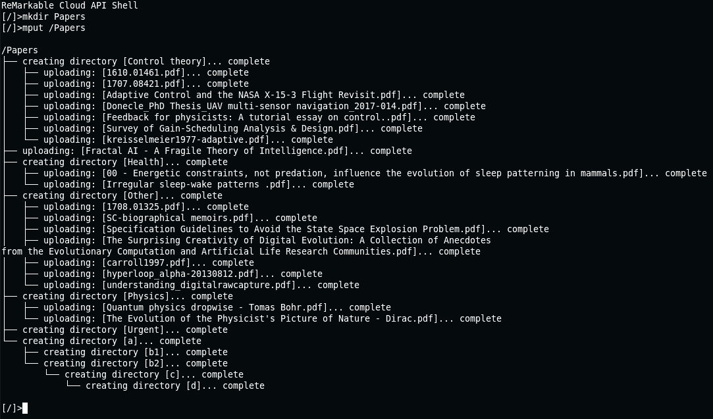

# rMAPI

*Note: rMAPI is effectiviely unmaintaied at this point, and will be archived in the next few weeks. Please see https://github.com/juruen/rmapi/discussions*

[](https://github.com/juruen/rmapi/actions)


rMAPI is a Go app that allows you to access the ReMarkable Cloud API programmatically.

You can interact with the different API end-points through a shell. However, you can also
run commands non-interactively. This may come in handy to script certain workflows such as
taking automatic backups or uploading documents programmatically.


# Some examples of use

[Tutorial on how to directly print to your reMarkable on Mac with rMAPI](docs/tutorial-print-macosx.md)

# Warning: experimental support for the new sync protocol

If `rmapi` stopped working for you in a such way that `gets` were working fine but `puts` didn't seem to work, this
is relevant for you.

A few months ago, the `Remarkable` folks introduced a new sync protocol. This new protocol is being rolling out 
incrementally. Some users are being forced to use it, and some other users are still using the old protocol that
`rmapi` has supported well for a few years now.

Unfortunately, the `rmapi` contributors are still on the old protocol and this makes it more difficult to test
the new protocol's implementation. However, as we know that there are many users who would like to use
`rmapi` with the new protocol, we have added experimental support for it. The always awesome @ddvk did all the work
here!

Although `rmapi` will warn you if it needs to use the new protocol, we'd like to take this opportunity again to reiterate that the
support for the new protocol is experimental, and you should make sure you have a back-up of your files in case something goes wrong.


# Install

## From sources

Install and build the project:

```
git clone https://github.com/juruen/rmapi
cd rmapi
go install
```

## Binary

You can download an already built version for either Linux or OSX from [releases](https://github.com/juruen/rmapi/releases).

## Docker

First clone this repository, then build a local container like

```
docker build -t rmapi .
```

create the .config/rmapi config folder

```
mkdir -p $HOME/.config/rmapi
``` 

and run by mounting the .config/rmapi folder

```
docker run -v $HOME/.config/rmapi/:/home/app/.config/rmapi/ -it rmapi
```

Issue non-interactive commands by appending to the `docker run` command:

```
docker run -v $HOME/.config/rmapi/:/home/app/.config/rmapi/ rmapi help
```

# API support

- [x] list files and directories
- [x] move around directories
- [x] download a specific file
- [x] download a directory and all its files and subdiretores recursively
- [x] create a directory
- [x] delete a file or a directory
- [x] move/rename a file or a directory
- [x] upload a specific file
- [ ] live syncs

# Annotations

- Initial support to generate a PDF with annotations.

# Shell ergonomics

- [x] autocomplete
- [ ] globbing
- [x] upload a directory and all its files and subdirectories recursively

# Commands

Start the shell by running `rmapi`

## List current directory

Use `ls` to list the contents of the current directory. Entries are listed with `[d]` if they
are directories, and `[f]` if they are files.

## Change current directory

Use `cd` to change the current directory to any other directory in the hierarchy.

## Find a file

The command  `find` takes one or two arguments.

If only the first argument is passed, all entries from that point are printed recursively.

When the second argument is also passed, a regexp is expected, and only those entries that match the regexp are printed.

Golang standard regexps are used. For instance, to make the regexp case insensitve you can do:

```
find . (?i)foo
```

## Upload a file

Use `put path_to_local_file` to upload a file  to the current directory.

You can also specify the destination directory:

```
put book.pdf /books
```

## Recursively upload directories and files

Use `mput path_to_dir` to recursively upload all the local files to that directory.

E.g: upload all the files

```
mput /Papers
```



## Download a file

Use `get path_to_file` to download a file from the cloud to your local computer.

## Recursively download directories and files

Use `mget path_to_dir` to recursively download all the files in that directory.

E.g: download all the files

```
mget .
```

## Download a file and generate a PDF with its annoations

Use `geta` to download a file and generate a PDF document
with its annotations.

Please note that its support is very basic for now and only supports one type of pen for now, but
there's work in progress to improve it.

## Create a directoy

Use `mkdir path_to_new_dir` to create a new directory

## Remove a directory or a file

Use `rm directory_or_file` to remove. If it's directory, it needs to be empty in order to be deleted.

You can remove multiple entries at the same time.

## Move/rename a directory or a file

Use `mv source destination` to move or rename a file or directory.

## Stat a directory or file

Use `stat entry` to dump its metadata as reported by the Cloud API.

# Run command non-interactively

Add the commands you want to execute to the arguments of the binary.

E.g: simple script to download all files from the cloud to your local machine

```bash
$ rmapi mget .
```

rMAPI will set the exit code to `0` if the command succeedes, or `1` if it fails.

# Environment variables

- `RMAPI_CONFIG`: filepath used to store authentication tokens. When not set, rmapi uses the file `.rmapi` in the home directory of the current user.
- `RMAPI_TRACE=1`: enable trace logging.
- `RMAPI_USE_HIDDEN_FILES=1`: use and traverse hidden files/directories (they are ignored by default).
- `RMAPI_THUMBNAILS`: generate a thumbnail of the first page of a pdf document
- `RMAPI_AUTH`: override the default authorization url
- `RMAPI_DOC`: override the default document storage url
- `RMAPI_HOST`: override all urls 
- `RMAPI_CONCURRENT`: sync15: maximum number of goroutines/http requests to use (default: 20)
